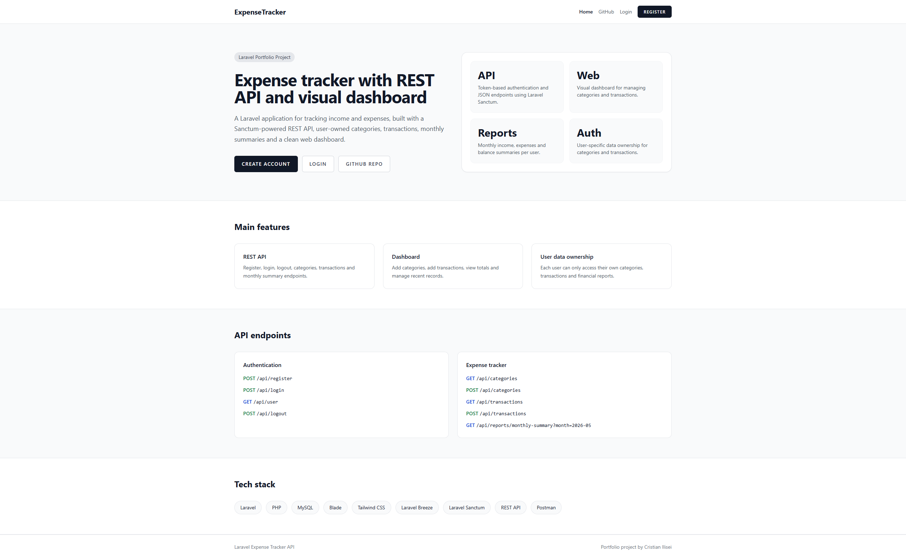
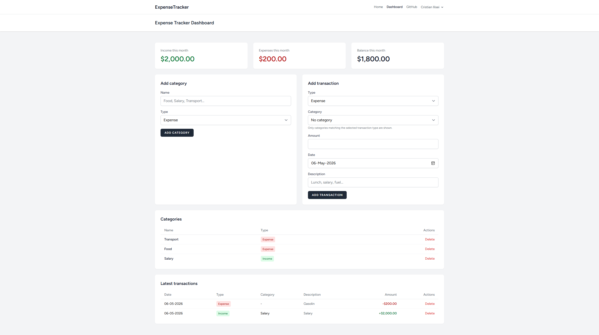
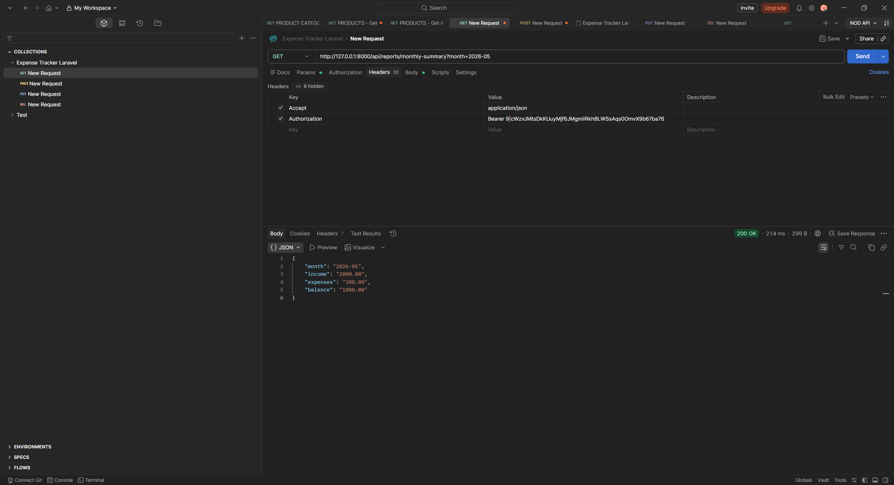

# Laravel Expense Tracker API

A Laravel portfolio project for tracking personal income and expenses.

The project includes both a REST API and a visual web dashboard. Users can register, log in, create income and expense categories, add transactions, view monthly totals, and manage their own financial data.

---

## Screenshots

### Landing Page



### Dashboard



### Postman Monthly Summary API



---

## Main Features

### Authentication

- User registration and login
- Laravel Breeze web authentication
- Laravel Sanctum API token authentication
- Authenticated user endpoint
- Logout endpoint
- User-owned data protection

### Web Dashboard

- Visual dashboard for authenticated users
- Monthly income, expenses and balance cards
- Add income and expense categories
- Category list with type badges
- Delete categories
- Add income and expense transactions
- Transaction list with formatted amounts
- Delete transactions
- Flash messages with auto-dismiss and manual close
- Category dropdown filtered by selected transaction type

### REST API

- Register and login through API
- Token-based authentication using Laravel Sanctum
- Categories API
- Transactions API
- Monthly summary report API
- Transaction filtering by:
    - type
    - category
    - date range
- Paginated transaction responses
- User data ownership validation

### Reports

- Monthly income summary
- Monthly expense summary
- Monthly balance calculation
- Report endpoint scoped to authenticated user

---

## Tech Stack

- Laravel
- PHP
- MySQL
- Blade
- Tailwind CSS
- Laravel Breeze
- Laravel Sanctum
- Eloquent Relationships
- REST API
- Postman

---

## Database Structure

Main tables used in this project:

- users
- personal_access_tokens
- categories
- transactions

Relationships:

- A user has many categories
- A user has many transactions
- A category belongs to a user
- A category has many transactions
- A transaction belongs to a user
- A transaction belongs to a category

---

## API Endpoints

### Authentication

| Method | Endpoint        | Description                     |
| ------ | --------------- | ------------------------------- |
| POST   | `/api/register` | Register a new user             |
| POST   | `/api/login`    | Login and receive API token     |
| GET    | `/api/user`     | Get authenticated user          |
| POST   | `/api/logout`   | Logout and delete current token |

### Categories

| Method    | Endpoint                     | Description                          |
| --------- | ---------------------------- | ------------------------------------ |
| GET       | `/api/categories`            | List authenticated user's categories |
| POST      | `/api/categories`            | Create category                      |
| GET       | `/api/categories/{category}` | Show category                        |
| PUT/PATCH | `/api/categories/{category}` | Update category                      |
| DELETE    | `/api/categories/{category}` | Delete category                      |

### Transactions

| Method    | Endpoint                          | Description                            |
| --------- | --------------------------------- | -------------------------------------- |
| GET       | `/api/transactions`               | List authenticated user's transactions |
| POST      | `/api/transactions`               | Create transaction                     |
| GET       | `/api/transactions/{transaction}` | Show transaction                       |
| PUT/PATCH | `/api/transactions/{transaction}` | Update transaction                     |
| DELETE    | `/api/transactions/{transaction}` | Delete transaction                     |

### Reports

| Method | Endpoint                                     | Description                              |
| ------ | -------------------------------------------- | ---------------------------------------- |
| GET    | `/api/reports/monthly-summary?month=2026-05` | Get monthly income, expenses and balance |

---

## Example API Requests

### Register

```http
POST /api/register
Accept: application/json
Content-Type: application/json
```

```json
{
    "name": "Cristian Ilisei",
    "email": "cristian@example.com",
    "password": "12345678",
    "password_confirmation": "12345678"
}
```

### Login

```http
POST /api/login
Accept: application/json
Content-Type: application/json
```

```json
{
    "email": "cristian@example.com",
    "password": "12345678"
}
```

### Create Category

```http
POST /api/categories
Accept: application/json
Authorization: Bearer YOUR_API_TOKEN
Content-Type: application/json
```

```json
{
    "name": "Food",
    "type": "expense"
}
```

### Create Transaction

```http
POST /api/transactions
Accept: application/json
Authorization: Bearer YOUR_API_TOKEN
Content-Type: application/json
```

```json
{
    "category_id": 1,
    "type": "expense",
    "amount": 25.5,
    "description": "Lunch",
    "transaction_date": "2026-05-06"
}
```

### Monthly Summary

```http
GET /api/reports/monthly-summary?month=2026-05
Accept: application/json
Authorization: Bearer YOUR_API_TOKEN
```

Example response:

```json
{
    "month": "2026-05",
    "income": "2000.00",
    "expenses": "200.00",
    "balance": "1800.00"
}
```

---

## Web Dashboard

The project also includes a visual dashboard for authenticated users.

Dashboard features:

- Monthly income card
- Monthly expenses card
- Monthly balance card
- Category creation form
- Transaction creation form
- Categories table
- Transactions table
- Delete actions for categories and transactions
- Flash messages for success and validation feedback

Dashboard route:

```text
/dashboard
```

Authentication routes:

```text
/register
/login
```

---

## Installation

Clone the repository:

```bash
git clone https://github.com/cristianilisei96/laravel-expense-tracker-api.git
```

Go into the project folder:

```bash
cd laravel-expense-tracker-api
```

Install PHP dependencies:

```bash
composer install
```

Install JavaScript dependencies:

```bash
npm install
```

Copy the environment file:

```bash
cp .env.example .env
```

Generate application key:

```bash
php artisan key:generate
```

Configure your database in `.env`:

```env
DB_CONNECTION=mysql
DB_HOST=127.0.0.1
DB_PORT=3306
DB_DATABASE=laravel_expense_tracker_api
DB_USERNAME=root
DB_PASSWORD=
```

Run migrations:

```bash
php artisan migrate
```

Start the Laravel development server:

```bash
php artisan serve
```

Start Vite:

```bash
npm run dev
```

Open the application:

```text
http://127.0.0.1:8000
```

---

## Useful Commands

Run migrations:

```bash
php artisan migrate
```

Reset database:

```bash
php artisan migrate:fresh
```

List routes:

```bash
php artisan route:list
```

List API routes:

```bash
php artisan route:list --path=api
```

Clear Laravel cache:

```bash
php artisan optimize:clear
```

Run Vite:

```bash
npm run dev
```

Build frontend assets:

```bash
npm run build
```

---

## Project Purpose

This project was built as a Laravel portfolio project to demonstrate:

- REST API development
- Laravel Sanctum authentication
- Laravel Breeze web authentication
- Eloquent relationships
- Form validation
- User-owned data protection
- API testing with Postman
- Blade and Tailwind CSS dashboard development
- Clean Laravel project structure

---

## Future Improvements

- Feature tests for authentication, categories, transactions and reports
- API Resources for cleaner JSON responses
- Form Request classes for validation
- Transaction edit functionality in the web dashboard
- Advanced filters in the dashboard
- Charts for monthly income and expenses
- Export transactions to CSV
- Multi-currency support

---

## Author

Portfolio project by Cristian Ilisei.
